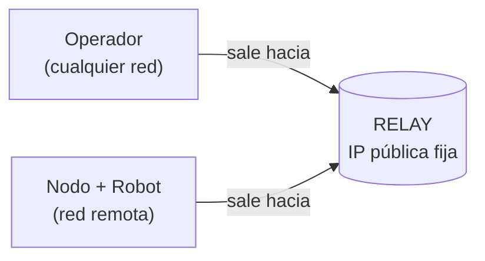
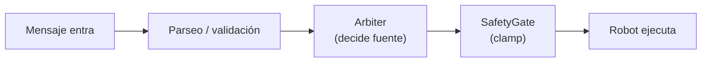

# Plan Técnico: Sistema de Teleoperación Remota

Backend de control, arbitraje de comandos, seguridad y conectividad remota para manos robóticas.

> Para una vista rápida del proyecto (qué hace, tecnologías, cómo correrlo) ver el [README](README.md).

**Versión:** 1.2
**Estado:** Fases 0–3 completadas, Fase 4 en curso, Fase 7 con código listo (despliegue pendiente)

---

## Índice

1. [Resumen](#1-resumen)
2. [Objetivos](#2-objetivos)
3. [Principios de diseño](#3-principios-de-diseño)
4. [Arquitectura](#4-arquitectura)
5. [Fases del proyecto](#5-fases-del-proyecto)
6. [Estado actual](#6-estado-actual)
7. [Consideraciones técnicas](#7-consideraciones-técnicas)
8. [Próximos pasos](#8-próximos-pasos)

---

## 1. Resumen

El sistema permite controlar un actuador robótico a distancia, con arbitraje de comandos, validación de seguridad, y (en fases posteriores) grabación de sesiones para entrenamiento de modelos de control autónomo. El diseño toma como referencia arquitecturas de teleoperación de baja latencia usadas en sistemas de producción del sector, adaptadas a la escala del proyecto.

El desarrollo avanza por fases incrementales: primero se asegura un circuito de control local sólido y seguro, y recién después se suma la capa de conectividad remota (relay) y el hardware físico real.

---

## 2. Objetivos

- Controlar en tiempo real una mano robótica desde un cliente operador.
- Garantizar que ningún comando llegue al actuador sin pasar por validación de seguridad.
- Permitir que el operador controle el robot desde una ubicación distinta a la del hardware (objetivo final del proyecto).
- Registrar cada sesión como datos reutilizables para entrenar modelos de IA.

---

## 3. Principios de diseño

1. **Capas independientes por responsabilidad**: cliente de control, transporte/red, y nodo de ejecución del robot. Cada una reemplazable sin tocar las demás.
2. **Un único punto de arbitraje**: cuando hay más de una fuente posible de control, una única función (`Arbiter`) decide quién manda, con prioridad fija y auditable.
3. **Seguridad aplicada del lado del robot, nunca del cliente**: ningún comando se confía solo por haber llegado por red.
4. **Canal de control separado del canal de grabación**: para que grabar datos nunca degrade la latencia del control en tiempo real.

---

## 4. Arquitectura

### 4.1 Componentes

| Componente | Responsabilidad |
|---|---|
| **Cliente** | Interfaz desde donde el operador emite comandos |
| **Relay** | Servidor intermediario con IP pública fija; empareja cliente y nodo cuando están en redes distintas |
| **Nodo del robot** (`Server_Teleop`) | Recibe comandos, arbitra, valida seguridad, ejecuta sobre el actuador |
| **Servicio de grabación** *(futuro)* | Persiste cada sesión como dataset estructurado |

### 4.2 Por qué el relay es necesario

Operador y robot van a estar en redes distintas (ese es el objetivo del proyecto), y cada red está detrás de NAT: ningún router deja pasar conexiones entrantes no solicitadas. La solución: ambos extremos inician conexiones **salientes** hacia el relay (que sí tiene IP pública), y el relay los empareja por ID de sesión, reenviando bytes sin interpretarlos.

### 4.3 Flujo interno del nodo (pipeline de control)

---

## 5. Fases del proyecto

### Fase 0: Línea base de medición (Completada)
Medición de RTT (round-trip time) en localhost con timestamps, como referencia para comparar contra red real o cambios de transporte más adelante.

### Fase 1: Interfaz de control local (mock de hardware) (Completada)
Clase de robot simulado (`RobotFakeHand`) con la misma interfaz que tendrá el hardware real (`move_specific_position`, `get_state`), permitiendo desarrollar sin depender del actuador físico. El servidor actual (`remote_server.py`) ya no usa este mock: fue reemplazado por `RobotPyBullet`, que simula el brazo con física real en PyBullet manteniendo la misma interfaz.

### Fase 2: Canal de control cliente-servidor (Completada)
Servidor WebSocket con conexión persistente, parseo y validación de comandos (formato `joint_id,position`), manejo de errores sin interrupción del servicio, y cliente interactivo con sesión continua.

### Fase 3: Arbitraje de comandos (Completada)
Componente `Arbiter` con fuentes `ESTOP`, `TELEOP`, `HOLD` (enum), prioridad fija (`ESTOP > TELEOP > HOLD`), activación manual de emergencia por comando dedicado, con desactivación exclusivamente explícita (nunca automática) y estado persistente entre mensajes.

### Fase 4: Capa de seguridad (SafetyGate) (En curso)
- Clamp de espacio de trabajo: ningún `position` puede salir de un rango permitido.
- Clamp de velocidad: ningún salto entre comandos consecutivos supera un máximo por ciclo.
- Estado actual: stub sin implementar, `check()` permite cualquier movimiento por ahora. Falta la ficha técnica del actuador para definir los límites reales antes de programar la lógica.

### Fase 5: Optimización de transporte (Pendiente)
Evaluación de WebSocket/TCP vs. transporte de datagramas (WebRTC/QUIC) para el canal de control en tiempo real, comparando contra la línea base de la Fase 0.

### Fase 6: Grabación de sesiones (Pendiente)
Registro de estado, acción y fuente de control por ciclo, transmitido por canal independiente del control en tiempo real, empaquetado en formato estructurado para entrenamiento.

### Fase 7: Relay / conectividad entre redes distintas (Código listo, despliegue pendiente)
Servidor `Relay` (`relay/relay.py`) que empareja operador y nodo del robot por `session_id` y reenvía mensajes entre ambos sin interpretarlos. Protocolo de registro: primer mensaje `REGISTER,<role>,<session_id>` (`role` en `operator`/`robot`); a partir de ahí todo lo que envía un lado se reenvía tal cual al otro. Notifica a los peers cuando el otro se conecta o se desconecta. Probado en local (`localhost`); falta desplegarlo en un VPS con IP pública para conectar operador y robot en redes distintas de verdad (ver [requisitos pendientes](requisitos_pendientes.md#1-servidor-en-la-nube-para-el-relay--fase-7)). Esta fase es requisito para el objetivo final del proyecto (operación remota real), no una optimización opcional.

### Fase 8: Integración con hardware real (Pendiente)
Reemplazo de la implementación simulada por una clase que hable con el SDK/protocolo real del actuador (serial/USB, CAN, u otro). Requiere: acceso remoto (SSH) a la máquina conectada al robot, ficha técnica (DOF, límites articulares, velocidad máxima), procedimiento de parada de emergencia física.

---

## 6. Estado actual

| Fase | Estado |
|---|---|
| 0: Línea base de medición | Completada |
| 1: Interfaz de control local (mock) | Completada |
| 2: Canal cliente-servidor | Completada |
| 3: Arbitraje de comandos | Completada |
| 4: Capa de seguridad | En curso |
| 5: Optimización de transporte | Pendiente |
| 6: Grabación de sesiones | Pendiente |
| 7: Relay / conectividad remota | Código listo, despliegue pendiente |
| 8: Integración con hardware real | Pendiente |

---

## 7. Consideraciones técnicas

**Transporte:** TCP puede introducir bloqueo de cabeza de línea ante pérdida de paquetes. Para control en tiempo real, un transporte de datagramas no garantizados es más apropiado, porque el comando más reciente vale más que garantizar la entrega de uno antiguo.

**Concurrencia:** el servidor usa programación asíncrona (`asyncio`) para atender múltiples conexiones. Pendiente: `RobotPyBullet.move_specific_position` hace `time.sleep` de forma síncrona dentro del handler async, así que mientras un brazo se mueve (~0.25 s) el event loop queda bloqueado para cualquier otra conexión. Con un solo operador conectado no se nota, pero es una limitación real a resolver antes de soportar más de una sesión a la vez. Toda sección que modifique estado compartido del robot debe protegerse contra condiciones de carrera.

**Extensibilidad:** la interfaz de control (`move_specific_position`, `get_state`) se mantiene idéntica entre la implementación simulada y la real, para que el resto del sistema no requiera cambios al incorporar el actuador físico.

---

## 8. Próximos pasos

- [ ] Terminar la capa de seguridad (Fase 4): clamps de rango y velocidad.
- [ ] Definir límites físicos reales del actuador en cuanto se disponga de la ficha técnica.
- [ ] Solicitar acceso remoto (SSH) a la máquina conectada al robot.
- [ ] Evaluar proveedor de VPS económico para el relay (Fase 7).
